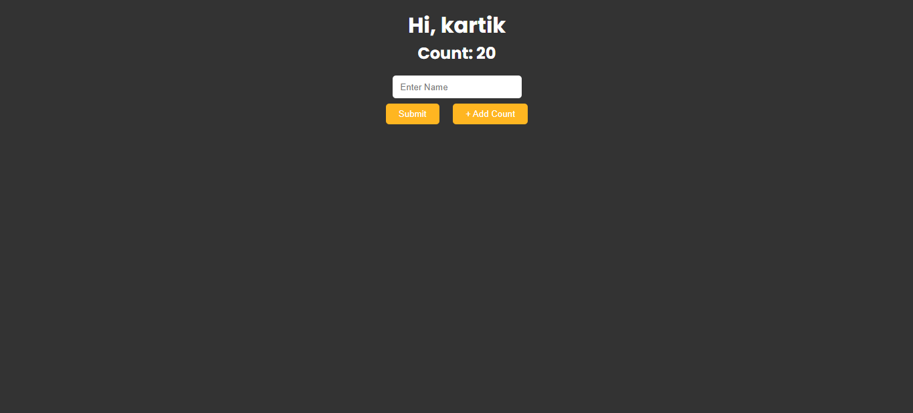

# Learn Svelte and understanding syntax
 Learn Svelte and understanding syntax

- In this project I am learn to create component and pass data between one component to another

- Also Create an Event Dispatcher. Which is help to send data to parent component.

-- Here I don't used any store.

